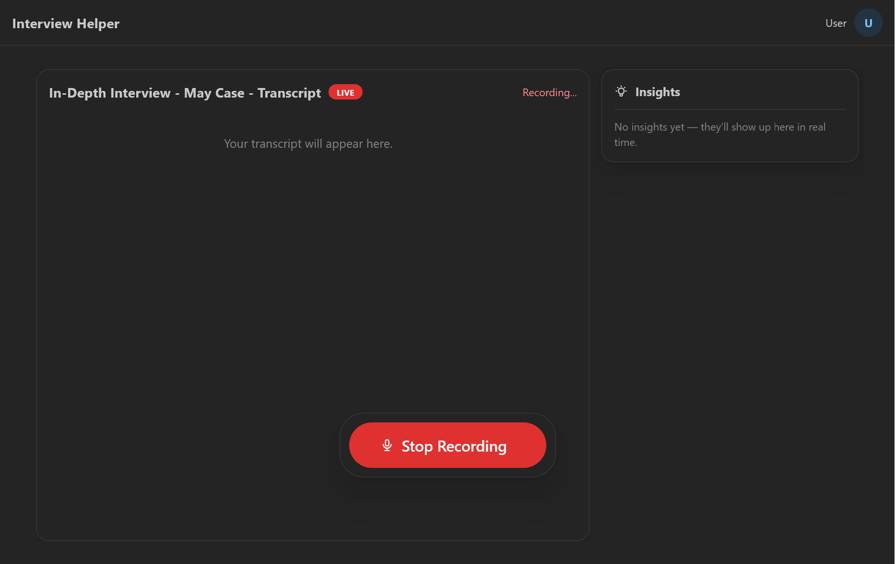

# Real-time SAR Interview Assistant

A real-time, end-to-end system for Search and Rescue operations that suggests context-aware follow-up questions and extracts actionable clues during interviews with missing persons' contacts.



## Vision

In Search and Rescue (SAR) operations, time pressure and inexperience can lead to missed opportunities during interviews with a missing person's friends and family. This system leverages large language models (LLMs), agentic design patterns, and integration with the IntelliSAR platform to assist interviewers in surfacing more complete and relevant information. It compiles key insights into a structured clue log, ready for human review, refinement, and dissemination to the rest of the team.

**Ultimate Goal:** Accelerate clue discovery and reduce the likelihood of critical information being overlooked in time-sensitive SAR missions.

## Architecture

### Backend (`/backend`)

- **Python-based** transcription and processing server
- **WebRTC** real-time audio streaming
- **Vosk** speech-to-text processing
- **WebSocket** communication
- Structured data models with **Pydantic**

### Frontend (`/frontend`)

- **React + TypeScript** user interface
- **Vite** development server
- **TailwindCSS** styling
- Real-time WebRTC audio capture and streaming

### Tech Stack

- **AI/ML:** LangGraph, LangChain, Langfuse
- **Backend:** Python 3.13+, WebRTC (aiortc), WebSockets, Vosk
- **Frontend:** React 19, TypeScript, Vite, TailwindCSS
- **Real-time:** WebRTC for audio streaming
- **Data:** Pydantic for structured models

## Prerequisites

- **Python 3.13+**
- **Node.js** (for frontend)
- **pnpm** (package manager)
- **mkcert** (for SSL certificates)
- **uv** (Python package manager)

## Installation & Setup

### 1. SSL Certificates

Generate local SSL certificates for HTTPS (required for WebRTC):

```bash
just create-cert
```

### 2. Backend Setup

Copy the .env.example to .env, then to install dependencies and setup the database:

```bash
cd backend
uv sync
uv run alembic upgrade head
```

### 3. Frontend Setup

```bash
cd frontend
pnpm install
```

### 4. Vosk Model Download

The system uses Vosk for speech recognition. Please download a model from https://alphacephei.com/vosk/models and place into `backend/vosk_models/`.

### 5. Pre-Commit Hook Setup

In the root of the repo run:

```bash
pre-commit install
```

## Development

### Start Backend Server

```bash
cd backend
uv run ./src/main.py
```

### Start Frontend Development Server

```bash
cd frontend
pnpm dev
```

The frontend will be available at `https://localhost:5173` and the backend WebRTC server runs on the configured port.

## Project Structure

```
├── backend/                    # Python backend
│   ├── config/                # Configuration management
│   ├── handlers/              # WebRTC and protocol handlers
│   ├── models/                # Data models (Pydantic)
│   ├── services/              # Core business logic
│   ├── utils/                 # Utility functions
│   ├── vosk_models/           # Speech recognition models
│   ├── audio_recordings/      # Recorded audio files
│   ├── transcriptions/        # Generated transcripts
│   └── server.py              # Main server entry point
├── frontend/                  # React frontend
│   ├── src/                   # Source code
│   ├── public/                # Static assets
│   └── package.json           # Dependencies
├── cert/                      # SSL certificates
├── Justfile                   # Task runner commands
└── README.md                  # This file
```

### Structurizr

See an interactive diagram of the architecture:

```
docker run -it --rm -p 8080:8080 -v docs:/usr/local/structurizr structurizr/lite
```

### LLM Eval Tests

To run the LLM eval tests, in the `backend/` dir run:

```
uv run deepeval test run -m "llm"  .\src\interview_helper\ai_analysis\eval\test_example.py
```

## Features

- **Real-time Audio Processing:** WebRTC-based audio capture and streaming
- **Speech-to-Text:** Vosk-powered transcription
- **Structured Data:** Pydantic models for consistent data handling
- **Secure Communication:** HTTPS/WSS with self-signed certificates
- **Development Tools:** Hot reload, TypeScript support, modern tooling

## Development Notes

- The system generates timestamped audio recordings and transcriptions
- SSL certificates are required for WebRTC functionality
- Both frontend and backend support hot reload during development
- Transcriptions are saved in both JSON and text formats for analysis
