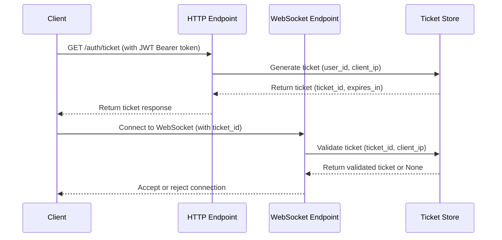

# Ticket-Based WebSocket Authentication

This document explains the ticket-based authentication system implemented for WebSocket connections in the Interview Helper application.

## Overview

The ticket-based authentication system provides an additional security layer for WebSocket connections by requiring clients to obtain a single-use authentication ticket before establishing a WebSocket connection. This approach is more secure than passing JWT tokens directly to WebSocket endpoints.

## How It Works

### 1. Authentication Flow



### 2. Step-by-Step Process

1. **Client requests ticket**: Frontend calls `/auth/ticket` endpoint with valid JWT token
2. **Server generates ticket**: Backend creates a single-use ticket containing user ID, client IP, and expiration
3. **Client connects to WebSocket**: Frontend uses ticket_id as query parameter: `/ws?ticket_id=<ticket_id>`
4. **Server validates ticket**: Backend verifies ticket, checks IP address, ensures it's not expired or already used
5. **Connection established**: If ticket is valid, WebSocket connection is accepted

## Security Features

### Single-Use Tickets
- Each ticket can only be used once
- After validation, tickets are automatically marked as used
- Prevents replay attacks

### IP Address Validation
- Tickets include the client's IP address
- WebSocket connections must come from the same IP that requested the ticket
- Prevents ticket theft and usage from different locations

### Time-Limited Expiration
- Tickets expire after 5 minutes by default
- Reduces the window for potential attacks
- Automatic cleanup of expired tickets

### Rate Limiting
- Users can request maximum 10 tickets per minute
- Prevents abuse and denial-of-service attacks
- Rate limits are per-user based on JWT claims

## API Endpoints

### `GET /auth/ticket`

Generates a new authentication ticket for WebSocket connections.

**Request:**
- **Authorization**: `Bearer <jwt_token>` (required)
- **Headers**: `Content-Type: application/json`

**Response:**
```json
{
  "ticket_id": "randomly_generated_secure_token",
  "expires_in": 300
}
```

**Error Responses:**
- `401 Unauthorized`: Invalid or missing JWT token
- `429 Too Many Requests`: Rate limit exceeded (10 tickets/minute)

### `WebSocket /ws?ticket_id=<ticket_id>`

Establishes WebSocket connection using authentication ticket.

**Parameters:**
- **ticket_id**: The ticket ID obtained from `/auth/ticket` endpoint

**Connection Responses:**
- **Success**: WebSocket connection accepted
- **1008 Authentication Failed**: Invalid, expired, or already used ticket

### `GET /health`

Health check endpoint with ticket system status.

**Response:**
```json
{
  "status": "healthy",
  "service": "Interview Helper Backend",
  "ticket_system": {
    "active_tickets": 5,
    "default_expiration_seconds": 300
  }
}
```

## Frontend Implementation

The frontend uses a two-step process to establish authenticated WebSocket connections:

```typescript
// Step 1: Request authentication ticket
const ticketResponse = await fetch(`${backendUrl}/auth/ticket`, {
    method: "GET",
    headers: {
        Authorization: `Bearer ${accessToken}`,
        "Content-Type": "application/json",
    },
});

const ticketData = await ticketResponse.json();
const ticketId = ticketData.ticket_id;

// Step 2: Connect to WebSocket with ticket
const ws = new WebSocket(`${wsUrl}/ws?ticket_id=${ticketId}`);
```

## Configuration

### Ticket Expiration
Default ticket expiration is 5 minutes (300 seconds). This can be configured when creating the `TicketStore`:

```python
ticket_store = TicketStore(default_expiration_seconds=300)
```

### Rate Limiting
Default rate limit is 10 tickets per minute per user. This can be configured:

```python
TICKET_RATE_LIMIT_PER_MINUTE = 10
```

## Error Handling

### Common Error Scenarios

1. **Invalid Ticket**: Ticket doesn't exist or has been tampered with
2. **Expired Ticket**: Ticket was generated more than 5 minutes ago
3. **Used Ticket**: Ticket has already been used for a WebSocket connection
4. **IP Mismatch**: Client IP doesn't match the IP that requested the ticket
5. **Rate Limit**: User has requested too many tickets in a short time

### Error Messages

- `"Authentication ticket required"`: No ticket_id provided to WebSocket endpoint
- `"Invalid or expired authentication ticket"`: Ticket validation failed
- `"Authentication failed - ticket invalid or expired"`: Frontend error message
- `"Too many ticket requests..."`: Rate limit exceeded

## Benefits

1. **Enhanced Security**: Additional layer beyond JWT token validation
2. **Prevents Token Exposure**: JWT tokens are not passed to WebSocket URLs
3. **Single-Use Protection**: Tickets cannot be reused, preventing replay attacks
4. **IP Binding**: Tickets are tied to specific client IP addresses
5. **Time-Limited**: Short expiration window reduces attack surface
6. **Rate Protection**: Built-in rate limiting prevents abuse

## Monitoring

The system provides monitoring capabilities through:

- **Health Check Endpoint**: Monitor active ticket count and system status
- **Logging**: Comprehensive logging of ticket generation and validation
- **Rate Limit Tracking**: Monitoring of user request patterns

This ticket-based authentication system provides a robust, secure foundation for WebSocket connections in the Interview Helper application while maintaining ease of use for legitimate clients.